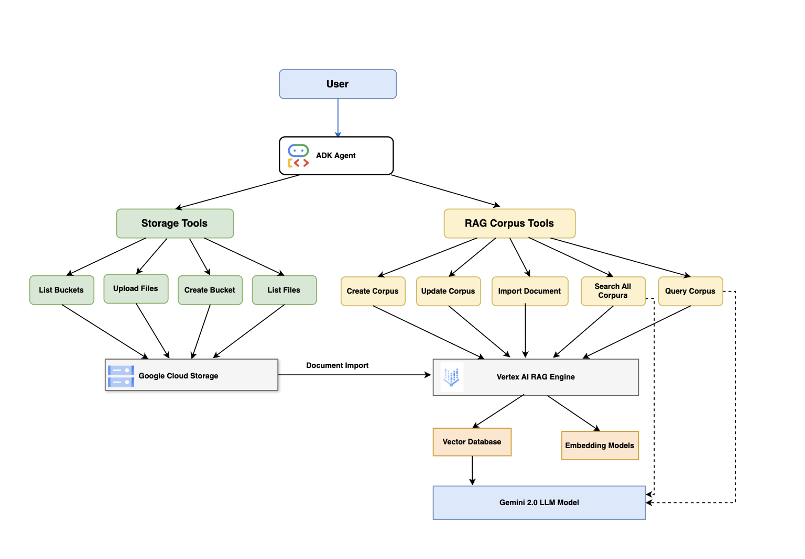

Get started by customizing your environment (defined in the .idx/dev.nix file) with the tools and IDE extensions you'll need for your project!

Learn more at https://firebase.google.com/docs/studio/customize-workspace

# Agent Development Kit (ADK) + Vertex AI RAG Engine

A production-ready Retrieval-Augmented Generation (RAG) engine built with Google's [Agent Development Kit (ADK)](https://google.github.io/adk-docs/) and [Vertex AI RAG Engine](https://cloud.google.com/vertex-ai/generative-ai/docs/rag-engine/rag-overview). This project provides a modular framework for managing Google Cloud Storage (GCS) buckets, RAG corpora, and document retrieval with a focus on best practices and user experience.

## Vertex AI RAG Engine

Vertex AI RAG Engine is a component of the Vertex AI Platform that facilitates Retrieval-Augmented Generation (RAG) and serves as a data framework for developing context-augmented large language model (LLM) applications. It enables you to enrich LLM context with your organization's private knowledge, reducing hallucinations and improving answer accuracy.

### RAG Process Concepts

These concepts are listed in the order of the retrieval-augmented generation (RAG) process:

1. **Data ingestion**: Intake data from different data sources. For example, local files, Cloud Storage, and Google Drive.

2. **Data transformation**: Conversion of the data in preparation for indexing. For example, data is split into chunks.

3. **Embedding**: Numerical representations of words or pieces of text. These numbers capture the semantic meaning and context of the text. Similar or related words or text tend to have similar embeddings, which means they are closer together in the high-dimensional vector space.

4. **Data indexing**: Vertex AI RAG Engine creates an index called a corpus. The index structures the knowledge base so it's optimized for searching. For example, the index is like a detailed table of contents for a massive reference book.

5. **Retrieval**: When a user asks a question or provides a prompt, the retrieval component in Vertex AI RAG Engine searches through its knowledge base to find information that is relevant to the query.

6. **Generation**: The retrieved information becomes the context added to the original user query as a guide for the generative AI model to generate factually grounded and relevant responses.

## Agent Development Kit (ADK)

[Agent Development Kit (ADK)](https://google.github.io/adk-docs/) is a flexible and modular framework for developing and deploying AI agents. Key features include:

- **Model-Agnostic**: While optimized for Gemini and the Google ecosystem, ADK works with any model.
- **Flexible Orchestration**: Define workflows using workflow agents (`Sequential`, `Parallel`, `Loop`) or leverage LLM-driven dynamic routing for adaptive behavior.
- **Multi-Agent Architecture**: Build modular applications by composing multiple specialized agents in a hierarchy.
- **Rich Tool Ecosystem**: Equip agents with diverse capabilities through pre-built tools, custom functions, third-party integrations, or even other agents as tools.
- **Deployment Ready**: Deploy agents anywhere – locally, on Vertex AI Agent Engine, or using Cloud Run/Docker.
- **Built-in Evaluation**: Assess agent performance by evaluating both response quality and execution trajectory.

ADK makes agent development feel more like software development, making it easier to create, deploy, and orchestrate agents ranging from simple tasks to complex workflows.

## Features

- 🗂️ **GCS Bucket Management**: Create, list, and manage GCS buckets for file storage.
- 📚 **RAG Corpus Management**: Create, update, list, and delete RAG corpora in Vertex AI.
- 📄 **Document Management**: Import documents from GCS into RAG corpora for vector search.
- 🔎 **Semantic Search**: Query RAG corpora for relevant information with citations.
- 🤖 **Agent-based Interface**: Interact with all functionalities through a natural language interface.
- ⚙️ **Configurable & Extensible**: Centralized configuration, emoji-enhanced responses, and schema-compliant tools.

## Pre-created RAG Corpora

The project includes several pre-created RAG corpora covering major AI topics:

- **Foundation Models & Prompt Engineering**: Resources on large language models and effective prompt design
- **Embeddings & Vector Stores**: Details on text embeddings and vector databases
- **Generative AI Agents**: Information on agent design, implementation, and usage
- **Domain-Specific LLMs**: Techniques for applying LLMs to solve domain-specific problems
- **MLOps for Generative AI**: Deployment and production considerations for GenAI systems

Each corpus contains relevant PDF documents imported from Google and Kaggle's Gen AI Intensive course:

- [Day 1: Foundational Models & Prompt Engineering](https://lnkd.in/d-_w3gXj)
- [Day 2: Embeddings & Vector Stores / Databases](https://lnkd.in/dkmfDUcp)
- [Day 3: Generative AI Agents](https://lnkd.in/dd3Zd2-F)
- [Day 4: Domain-Specific LLMs](https://lnkd.in/d6Z39yqt)
- [Day 5: MLOps for Generative AI](https://lnkd.in/dcXCTPVF)

These documents are from Google and Kaggle's Gen AI Intensive course, which broke the GUINNESS WORLD RECORDS™ title for the Largest Attendance at a Virtual AI Conference in One Week with more than 280,000 signups in just 20 days. The materials provide a comprehensive overview of Vertex AI capabilities and best practices for working with generative AI.

## Architecture

The project follows a modular architecture based on the ADK framework:



The architecture consists of several key components:

1. **User Interface**: Interact with the system through ADK Web or CLI
2. **Agent Development Kit (ADK)**: The core orchestration layer that manages tools and user interactions
3. **Function Tools**: Modular components divided into:
   - **Storage Tools**: For GCS bucket and file management
   - **RAG Corpus Tools**: For corpus management and semantic search
4. **Google Cloud Services**:
   - **Google Cloud Storage**: Stores document files
   - **Vertex AI RAG Engine**: Provides embedding, indexing and retrieval capabilities
   - **Gemini 2.0 LLM Model**: Generates responses grounded in retrieved contexts

## Prerequisites

- Python 3.11+ with uv
- Google Cloud project with Vertex AI API enabled
- [Google Cloud SDK](https://cloud.google.com/sdk/docs/install)
- Access to Vertex AI and Cloud Storage
- migrate-to-uv tool (optional)

## Installation

```bash
# Create and activate a virtual environment
uv venv
source .venv/bin/activate  # On Windows: .venv\Scripts\activate

# Install dependencies
uv sync # or uv pip install -r requirements.txt

# Configure your Google Cloud project
export GOOGLE_CLOUD_PROJECT="your-project-id"
export GOOGLE_CLOUD_LOCATION="us-central1"

# Enable required Google Cloud services
gcloud services enable aiplatform.googleapis.com --project=${GOOGLE_CLOUD_PROJECT}
gcloud services enable storage.googleapis.com --project=${GOOGLE_CLOUD_PROJECT}

# Set up IAM permissions
gcloud projects add-iam-policy-binding ${GOOGLE_CLOUD_PROJECT} \
    --member="user:YOUR_EMAIL@domain.com" \
    --role="roles/aiplatform.user"
gcloud projects add-iam-policy-binding ${GOOGLE_CLOUD_PROJECT} \
    --member="user:YOUR_EMAIL@domain.com" \
    --role="roles/storage.objectAdmin"

# Set up Gemini API key
# Get your API key from Google AI Studio: https://ai.google.dev/
export GOOGLE_API_KEY=your_gemini_api_key_here

# Set up authentication credentials
# Option 1: Use gcloud application-default credentials (recommended for development)
gcloud auth application-default login

# Option 2: Use a service account key (for production or CI/CD environments)
# Download your service account key from GCP Console and set the environment variable
export GOOGLE_APPLICATION_CREDENTIALS=/path/to/your/service-account-key.json
```

## Usage

### Running the Agent

There are two ways to run the agent:

```bash
# Option 1: Use ADK web interface (recommended for interactive usage)
adk web 

# Option 2: Run the agent directly in the terminal
adk run rag
```

The web interface provides a chat-like experience for interacting with the agent, while the direct run option is suitable for scripting and automated workflows.

### Example Commands

```text
# List all GCS buckets
[user]: List all GCS buckets

# Create a bucket for Foundation LLMs
[user]: Create a GCS bucket named "adk-embedding-vector-stores"

# Upload a document
[user]: Upload this PDF file to GCS bucket gs://adk-embedding-vector-stores/ and keep the same destination blob name

# Create a RAG corpus
[user]: Create a RAG corpus named "adk-embedding-vector-stores" with description "adk-embedding-vector-stores"

# Import a document into RAG corpus
[user]: Import the file gs://adk-embedding-vector-stores/emebddings-vector-stores.pdf into the RAG corpus

# Query a specific RAG corpus about prompt engineering
[user]: What is Chain of Thought (CoT)?

# Query across all corpora about MLOps
[user]: How do multiple teams collaborate to operationalize GenAI models?
```

## Configuration

Edit `rag/config/__init__.py` to customize your settings:

- `PROJECT_ID`: Your Google Cloud project ID
- `LOCATION`: Default location for Vertex AI and GCS resources
- `GCS_DEFAULT_*`: Defaults for GCS operations
- `RAG_DEFAULT_*`: Defaults for RAG operations
- `AGENT_*`: Settings for the agent

## Supported File Types

The engine supports various document types, including:
- PDF
- TXT
- DOC/DOCX
- XLS/XLSX
- PPT/PPTX
- CSV
- JSON
- HTML
- Markdown

## Troubleshooting

### Common Issues

- **403 Errors**: Make sure you've authenticated with `gcloud auth application-default login`
- **Resource Exhausted**: Check your quota limits in the GCP Console
- **Upload Issues**: Ensure your file format is supported and file size is within limits

## License

[MIT License](LICENSE)

## References

- [Google Agent Development Kit (ADK)](https://google.github.io/adk-docs/)
- [Vertex AI RAG Engine](https://cloud.google.com/vertex-ai/generative-ai/docs/rag-engine/rag-overview)
- [Google Cloud Storage](https://cloud.google.com/storage)
- Whitepaper:
    + [Prompt Engineering](https://www.kaggle.com/whitepaper-prompt-engineering)
    + [Foundational LLMs and Text Generation](https://www.kaggle.com/whitepaper-foundational-llm-and-text-generation)
    + [Agents](https://www.kaggle.com/whitepaper-agents)
    + [Agents Companion](https://www.kaggle.com/whitepaper-agent-companion)
    + [Embeddings & Vector Stores](https://www.kaggle.com/whitepaper-embeddings-and-vector-stores)
    + [Operationalizing GenAI on Vertex AI using MLOps](https://www.kaggle.com/whitepaper-operationalizing-generative-ai-on-vertex-ai-using-mlops)
    + [Solving Domain-Specific Problems using LLMs](https://www.kaggle.com/whitepaper-solving-domains-specific-problems-using-llms)

## Example Workflow

Below is a complete example workflow showing how to set up the entire RAG environment with the Google Gen AI Intensive course materials:

### 1. Create GCS Buckets

```text
Create the following 7 Google Cloud Storage buckets for my project, using the default settings (location: US, storage class: STANDARD) for all of them. Do not ask for confirmation for each bucket.

1. adk-prompt-engineering-dungnq49
2. adk-foundational-llm-and-text-generation-dungnq49
3. adk-agents-dungnq49
4. adk-agent-companion-dungnq49
5. adk-embedding-and-vector-stores-dungnq49
6. adk-operationalizing-generative-ai-on-vertex-ai-using-mlops-dungnq49
7. adk-solving-domains-specific-problems-using-llms-dungnq49
```

### 2. Upload PDF Files to GCS Buckets

```text
Upload the file "prompt-engineering.pdf" to the GCS bucket gs://adk-prompt-engineering-dungnq49/ and use "prompt-engineering.pdf" as the destination blob name. Do not ask for confirmation.

Upload the file "foundational-llm-and-text-generation.pdf" to the GCS bucket gs://adk-foundational-llm-and-text-generation-dungnq49/ and use "foundational-llm-and-text-generation.pdf" as the destination blob name. Do not ask for confirmation.

Upload the file "agents.pdf" to the GCS bucket gs://adk-agents-dungnq49/ and use "agents.pdf" as the destination blob name. Do not ask for confirmation.

Upload the file "agent-companion.pdf" to the GCS bucket gs://adk-agent-companion-dungnq49/ and use "agent-companion.pdf" as the destination blob name. Do not ask for confirmation.

Upload the file "embedding-and-vector-stores.pdf" to the GCS bucket gs://adk-embedding-and-vector-stores-dungnq49/ and use "embedding-and-vector-stores.pdf" as the destination blob name. Do not ask for confirmation.

Upload the file "operationalizing-generative-ai-on-vertex-ai-using-mlops.pdf" to the GCS bucket gs://adk-operationalizing-generative-ai-on-vertex-ai-using-mlops-dungnq49/ and use "operationalizing-generative-ai-on-vertex-ai-using-mlops.pdf" as the destination blob name. Do not ask for confirmation.

Upload the file "solving-domains-specific-problems-using-llms.pdf" to the GCS bucket gs://adk-solving-domains-specific-problems-using-llms-dungnq49/ and use "solving-domains-specific-problems-using-llms.pdf" as the destination blob name. Do not ask for confirmation.
```

### 3. Create RAG Corpora and Import Files

```text
Create a RAG corpus named "adk-prompt-engineering" with description of rag as "adk-prompt-engineering" and import the gs://adk-prompt-engineering-dungnq49/prompt-engineering.pdf into RAG corpus.

Create a RAG corpus named "adk-foundational-llm-and-text-generation" with description "adk-foundational-llm-and-text-generation" and import the file gs://adk-foundational-llm-and-text-generation-dungnq49/foundational-llm-and-text-generation.pdf into the RAG corpus.

Create a RAG corpus named "adk-agents" with description "adk-agents" and import the file gs://adk-agents-dungnq49/agents.pdf into the RAG corpus.

Create a RAG corpus named "adk-agent-companion" with description of rag as "adk-agent-companion" and import the gs://adk-agent-companion-dungnq49/agent-companion.pdf into RAG corpus.

Create a RAG corpus named "adk-embedding-and-vector-stores" with description "adk-embedding-and-vector-stores" and import the file gs://adk-embedding-and-vector-stores-dungnq49/embedding-and-vector-stores.pdf into the RAG corpus.

Create a RAG corpus named "adk-operationalizing-generative-ai-on-vertex-ai-using-mlops" with description "adk-operationalizing-generative-ai-on-vertex-ai-using-mlops" and import the file gs://adk-operationalizing-generative-ai-on-vertex-ai-using-mlops-dungnq49/operationalizing-generative-ai-on-vertex-ai-using-mlops.pdf into the RAG corpus.

Create a RAG corpus named "adk-solving-domains-specific-problems-using-llms" with description "adk-solving-domains-specific-problems-using-llms" and import the file gs://adk-solving-domains-specific-problems-using-llms-dungnq49/solving-domains-specific-problems-using-llms.pdf into the RAG corpus.
```

### 4. Query Across All Corpora

```text
# Questions about Prompt Engineering
What is Chain of Thought (CoT)?
What is Tree of Thoughts (ToT)?
What is ReAct (reason & act)?

# Quesions about Foundation LLM

# Questions about Agents & Agents Companion
What is Agent Lifecycle?

# Questions about Embeddings & Vector Stores
What are Types of embeddings?
What is Vector search?
What is Vector databases?

# Questions about MLOps & Operationalization
How do multiple teams collaborate to operationalize GenAI models?
How multiple teams collaborate to operationalize both models and GenAI applications?
```
